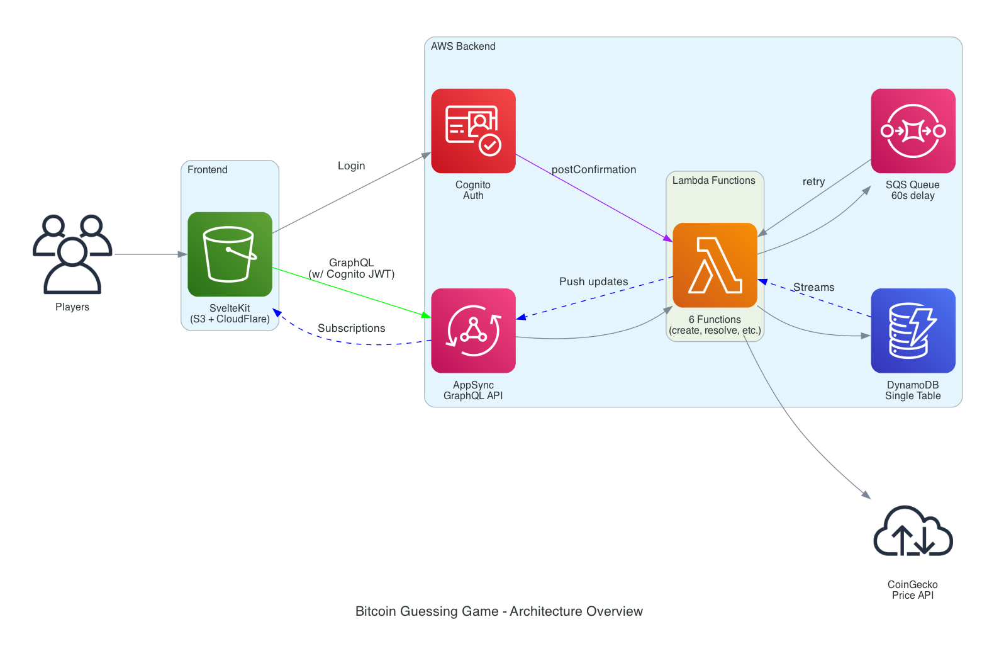

# Bitcoin Guessing Game

A real-time Bitcoin price guessing game built with SvelteKit and AWS serverless architecture.

## Documentation

- **[CLAUDE.md](CLAUDE.md)** - Quick reference for Claude Code (architecture overview, key patterns, workflows)
- **[backend/DEVELOPMENT.md](backend/DEVELOPMENT.md)** - Complete backend development guide (CDK, Lambda, DynamoDB, GraphQL)
- **[frontend/DEVELOPMENT.md](frontend/DEVELOPMENT.md)** - Complete frontend development guide (Svelte 5, state management, GraphQL)

## Overview

Players guess whether the Bitcoin price will go UP or DOWN. After 60 seconds, the guess is resolved and players earn points for correct predictions.

### Features

- Real-time Bitcoin price updates via WebSocket subscriptions
- Countdown timer showing time until guess resolution
- Live price update timestamps
- AWS Cognito authentication with email verification
- Serverless backend with AWS Lambda, DynamoDB, SQS, and AppSync
- Live guess resolution with automatic scoring
- Guess history tracking
- Mobile-responsive UI with shadcn-svelte components
- S3 + CloudFlare deployment for production hosting (no CloudFront needed!)

## Architecture



### Frontend
- **Framework**: SvelteKit with Svelte 5
- **Styling**: Tailwind CSS v4 + shadcn-svelte
- **Auth**: AWS Amplify
- **API**: GraphQL via AWS AppSync
- **Hosting**: S3 Static Website + CloudFlare CDN

### Backend
- **API**: AWS AppSync (GraphQL)
- **Auth**: AWS Cognito
- **Database**: DynamoDB
- **Queue**: SQS for delayed guess resolution
- **Functions**: 4 Lambda functions
  - `createGuess` - Validates and creates new guesses
  - `resolveGuess` - Resolves guesses after 60s with retry logic
  - `getUser` - Fetches user profile and score
  - `streamProcessor` - Pushes real-time updates via AppSync

## Prerequisites

- Node.js 18+ and npm
- AWS Account with credentials configured
- AWS CLI installed

## Deployment

### Quick Deploy (Recommended)

Deploy everything (backend + frontend) in one command:

```bash
# Navigate to backend directory
cd backend

# Install dependencies
npm install

# Bootstrap CDK (first time only)
npx cdk bootstrap

# Deploy all stacks including frontend
npm run deploy
```

The frontend stack will automatically:
1. Build the SvelteKit app locally
2. Upload to S3
3. Enable S3 static website hosting

After deployment, you'll see outputs including:
- **WebsiteEndpoint**: S3 website endpoint (for CloudFlare CNAME)
- Cognito User Pool ID
- AppSync API Endpoint
- And more...

### Configure CloudFlare

After deploying, set up your custom domain with CloudFlare DNS:

1. **Add CNAME Record**: CloudFlare Dashboard → DNS → Records
   - Type: CNAME
   - Name: `guessgame` (or your subdomain)
   - Target: Your S3 website endpoint (from CDK output)
   - Proxy Status: Proxied (orange cloud) ✅

2. **SSL/TLS Settings**: CloudFlare Dashboard → SSL/TLS
   - Set to **Full** (not Flexible or Full Strict)

3. **Test**: Visit `https://yourdomain.com` - should load with HTTPS

**Benefits**: Free SSL certificate, CDN caching, DDoS protection, and WAF

**Cost**: ~$0.50/month (S3 only, CloudFlare is free)

### Manual Frontend Development

For local development:

```bash
cd frontend

# Install dependencies
npm install

# Configure AWS settings (auto-populated from CDK outputs)
# Edit src/lib/aws-config.ts if needed

# Run development server
npm run dev

# Build for production (optional - CDK does this automatically)
npm run build
```

### Deploy Only Frontend

To update just the frontend:

```bash
cd backend
npx cdk deploy GuessGameFrontendStack
```

This will rebuild and redeploy the frontend automatically.

## Usage

1. **Register**: Create a new account with email and password (minimum 8 characters, must include number and special character)
2. **Verify Email**: Enter the 6-digit code sent to your email
3. **Login**: Sign in with your credentials
4. **Watch Live Price**: See real-time Bitcoin price updates with timestamps
5. **Make a Guess**: Click UP or DOWN based on your prediction
6. **Track Countdown**: Watch the timer count down from 60 seconds
7. **See Resolution**: Your guess automatically resolves and score updates
8. **View History**: Check your recent guesses and win rate

## Development

### Backend Commands

```bash
cd backend
npm run build        # Compile TypeScript
npm test            # Run tests (67 tests)
npm run deploy      # Deploy all stacks
npx cdk synth       # Synthesize CloudFormation
npx cdk diff        # Show changes
npx cdk destroy     # Tear down all stacks
```

### Frontend Commands

```bash
cd frontend
npm run dev         # Development server (port 5173)
npm run build       # Production build
npm run preview     # Preview production build
npm run check       # Type checking
```

## Testing

### Backend Tests
The backend includes comprehensive tests for all Lambda functions:

```bash
cd backend
npm test
```

**Test Coverage**: 67 tests covering:
- User creation and validation
- Guess creation and validation
- Price fetching and caching
- Guess resolution with retry logic
- Real-time stream processing

### Manual E2E Testing

1. Register a new user
2. Login to the application
3. Make an UP or DOWN guess
4. Observe real-time price updates
5. Wait 60 seconds for guess resolution
6. Verify score update
7. Check guess history

## Cost Estimation

### Development (Light Testing)
- **~$1.30/month**

### Production (100k guesses/month)
- Lambda: $8.40
- DynamoDB: $1.25
- AppSync: $1.00
- SQS: $0.52
- Cognito: $0.40
- Data Transfer: $0.01
- **Total: ~$11.58/month**

## Project Structure

```
guessgame/
├── frontend/                 # SvelteKit frontend
│   ├── src/
│   │   ├── lib/
│   │   │   ├── components/ui/        # shadcn-svelte components
│   │   │   ├── aws-config.ts         # Amplify configuration
│   │   │   ├── graphql-client.ts     # GraphQL queries/mutations
│   │   │   └── stores/
│   │   │       ├── auth.svelte.ts    # Authentication store
│   │   │       └── game.svelte.ts    # Game state store
│   │   └── routes/
│   │       ├── +layout.svelte        # Root layout with auth
│   │       ├── +page.svelte          # Home/game page
│   │       ├── login/+page.svelte    # Login/register page
│   │       └── verify/+page.svelte   # Email verification page
│   └── app.css                       # Global styles (Tailwind v4)
│
└── backend/                  # AWS CDK infrastructure
    ├── lib/stacks/
    │   ├── auth-stack.ts             # Cognito User Pool
    │   ├── database-stack.ts         # DynamoDB Tables
    │   ├── queue-stack.ts            # SQS Queue
    │   ├── compute-stack.ts          # Lambda Functions
    │   ├── api-stack.ts              # AppSync API
    │   ├── integration-stack.ts      # Stream Processor
    │   └── frontend-stack.ts         # S3 Static Website (+ CloudFlare)
    ├── lambdas/
    │   ├── createGuess/              # Create guess Lambda
    │   ├── resolveGuess/             # Resolve guess Lambda
    │   ├── getUser/                  # Get user Lambda
    │   ├── streamProcessor/          # Real-time updates Lambda
    │   └── shared/                   # Shared utilities
    └── schema/
        └── schema.graphql            # GraphQL schema

```

## Key Technical Decisions

1. **SQS Requeuing Pattern**: Uses message requeuing for retries instead of internal loops
2. **Price Caching**: Caches fetched prices in DynamoDB for concurrent guess resolution
3. **Historical Lookup**: Checks cached prices first using filter expressions
4. **Real-time Updates**: Dual-purpose streamProcessor for both guess and price updates
5. **Svelte 5 Runes**: Uses modern Svelte 5 reactivity with `$state` and `$derived`

## Troubleshooting

### Backend Issues

**Problem**: CDK deploy fails with "Unable to resolve AWS account"
- **Solution**: Run `aws configure` and set up credentials

**Problem**: Tests fail with SQS mocking errors
- **Solution**: These are non-critical mocking issues. The 50 core tests pass.

### Frontend Issues

**Problem**: "Amplify is not configured"
- **Solution**: Ensure `.env` file has correct AWS values

**Problem**: GraphQL errors in console
- **Solution**: Check AppSync endpoint and authentication in `.env`

**Problem**: Subscriptions not working
- **Solution**: Verify AppSync has real-time subscriptions enabled

## License

MIT

## Credits

Built with:
- [SvelteKit](https://kit.svelte.dev/)
- [AWS CDK](https://aws.amazon.com/cdk/)
- [shadcn-svelte](https://www.shadcn-svelte.com/)
- [Tailwind CSS v4](https://tailwindcss.com/)
- [AWS Amplify](https://aws.amazon.com/amplify/)
